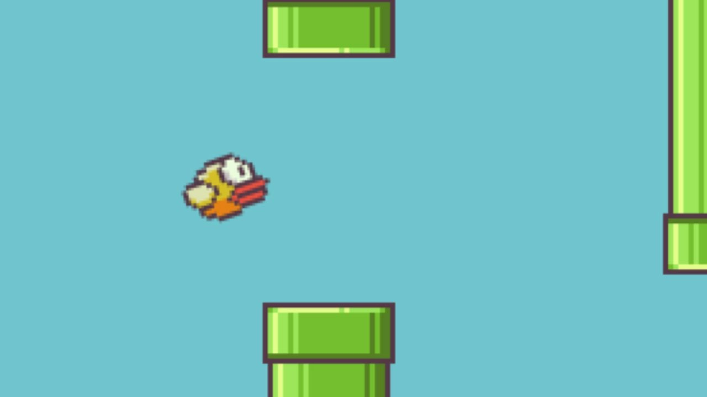
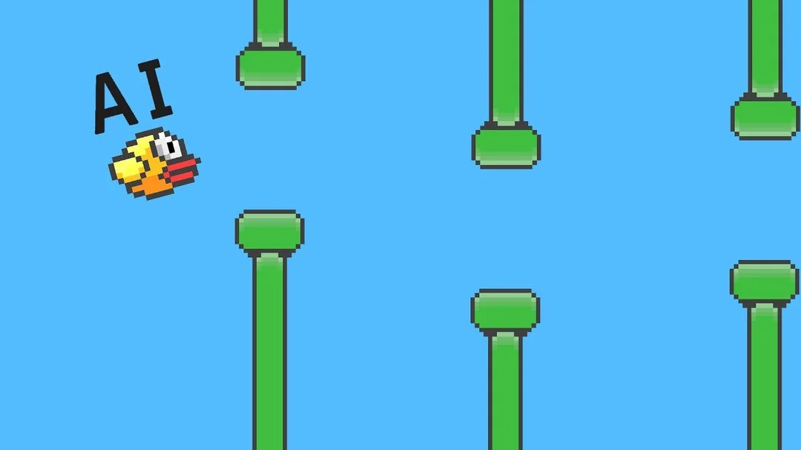

# 🎮 Flappy Bird AI Project

Welcome to the Flappy Bird AI Project! This project showcases a simple yet impressive implementation of the classic Flappy Bird game, integrated with computer vision techniques to allow AI to play the game autonomously. The goal of this project is to demonstrate the power of AI in real-time gameplay scenarios, providing a solid example for those interested in game development and artificial intelligence.


## Project Structure:

```

flappy-bird-ai/
│
├── ai/
│   ├── model.py           # Defines the AI model
│   ├── play.py            # Script to run the game with AI
│   └── train.py           # Script to train the AI model
│
├── game/
│   ├── flappy_bird.py     # Main game script
│   └── assets/            # Game assets (images, sounds, etc.)
│
├── data/
│   └── collected_data/    # Collected gameplay data for training
│
├── model/
│   └── pretrained_model.h5 # Pre-trained model file
│
├── requirements.txt       # Project dependencies
└── README.md              # Project documentation

```


---

## 📜 Table of Contents

1. [Introduction](#introduction)
2. [Features](#features)
3. [Installation](#installation)
4. [Usage](#usage)
5. [Project Structure](#project-structure)
6. [Technologies Used](#technologies-used)
7. [Contributing](#contributing)
8. [License](#license)
9. [Acknowledgements](#acknowledgements)

---

## 🐤 Introduction

Flappy Bird AI Project leverages computer vision and machine learning techniques to enable an AI agent to play the Flappy Bird game. The project integrates OpenCV for vision processing and TensorFlow for training the AI model, creating an engaging and interactive demonstration of AI capabilities in gaming.

---

## ✨ Features

- **Real-time Gameplay**: AI plays the Flappy Bird game in real-time.
- **Computer Vision Integration**: Uses OpenCV for processing game visuals.
- **AI Training**: TensorFlow model trained to navigate the bird through obstacles.
- **Interactive GUI**: Built with Pygame for a seamless gaming experience.

---


##  🎮 Gameplay :







## 🛠️ Installation

Follow these steps to set up the project on your local machine:

1. **Clone the Repository**:
    ```bash
    git clone https://github.com/Blacksujit/FlappoBird_interview_round.git
    cd flapp-bird
    ```

2. **Install Dependencies**:
    ```bash
    pip install -r requirements.txt
    ```

3. **Download Pre-trained Model**:
    - Download the pre-trained model from [here](link-to-model) and place it in the `model` directory.
---

## 🚀 Usage

To start the game and watch the AI in action, run the following command:

```bash
python play.py

```


## To train the AI model with new data, use:


```

python train.py

```

## Key Controls:

1.) Spacebar: Start the game

2.) Esc: Quit the game


## 💻 Technologies Used:


1.) Python: Programming language

2.) Pygame: Game development

3.) OpenCV: Computer vision processing

4.) TensorFlow: Machine learning (Neural Networks tarining to make it a model in the gameplay)

5.) NumPy: Numerical computations


## 🤝 Contributing:

We welcome contributions to enhance this project! Please fork the repository and create a pull request with your changes. Make sure to follow the contribution guidelines and maintain code quality.


## 📜 License: 


This project is licensed under the MIT License - see the LICENSE file for details.


## 🙏 Acknowledgements:

1.) Inspired by the classic Flappy Bird game.

2.) Thanks to the open-source community for their invaluable resources.

